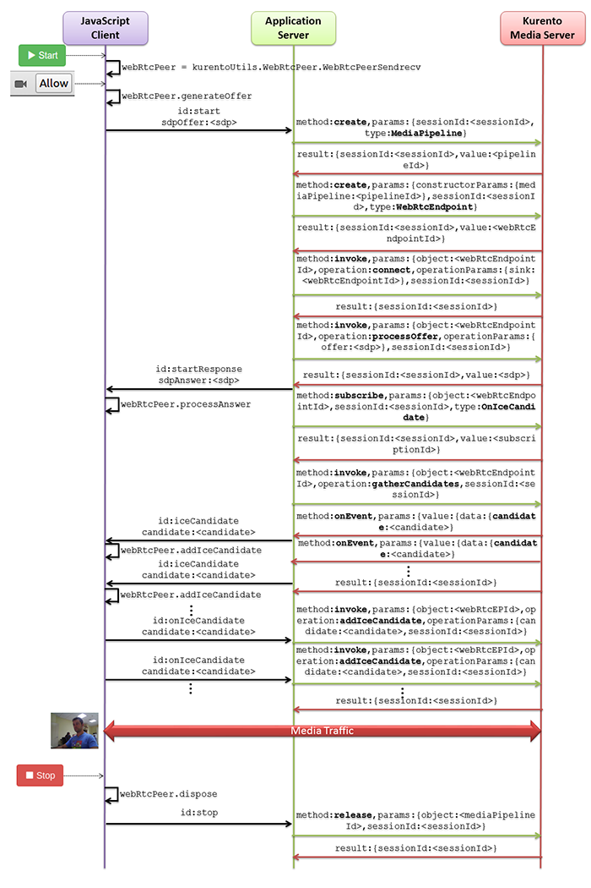

# WebRTC study notes

## Helloworld

Firstly the sequece is shown as bellow:


Study notes:

1. client initiates start
   ```
   var options = {
      localVideo: videoInput,
      remoteVideo: videoOutput,
      onicecandidate : onIceCandidate
    }

    webRtcPeer = kurentoUtils.WebRtcPeer.WebRtcPeerSendrecv(options, function(error) {
        if(error) return onError(error);
        this.generateOffer(onOffer);
    });
   ```
   
   and `webRtcPeer = kurentoUtils.WebRtcPeer.WebRtcPeerSendrecv` will do
   ```
   var configuration = recursive({ iceServers: freeice() }, options.configuration);
   pc = new RTCPeerConnection(configuration);
   ```
   a random ICE server chosed by `freeice` to be testing by `RTCPeerConnection` until a valid candidate sent to client through the `onIceCandidate` callback.

2. webRtcPeer.generateOffer
   ```
   pc.createOffer(function (offer) {
      console.log('Created SDP offer');
      offer = mangleSdpToAddSimulcast(offer);
      pc.setLocalDescription(offer, function () {
          console.log('Local description set', offer.sdp);
          callback(null, offer.sdp, self.processAnswer.bind(self));
      }, callback);
   }, callback, constraints);
   ```
   where it will invoke `setLocalDescription` in the RTCPeerConnection to set the local peer.

3. webRtcPeer.processAnswer
   ```
   var answer = new RTCSessionDescription({
       type: 'answer',
       sdp: sdpAnswer
   });
   console.log('SDP answer received, setting remote description');
   pc.setRemoteDescription(answer, function () {
      setRemoteVideo();
      callback();
   }, callback);
   ```
   where it will invoke `setRemoteDescription` in the RTCPeerConnection to set the remote peer.
   
4. ICE candidate from signalling channel
   ```
   case 'iceCandidate':
		webRtcPeer.addIceCandidate(parsedMessage.candidate)
		break;
   ```
   `webRtcPeer.addIceCandidate` will do `pc.addIceCandidate(candidate, callback, callback);`, that:
   > When a web site or app using RTCPeerConnection receives a new ICE candidate from the remote peer over its signaling channel, it should react by calling RTCPeerConnection.addIceCandidate() to hand off the newly-received candidate to the browser's ICE agent so that it's added to the remote description.
   
5. When start media exchange

   `step 1~4` is the media negotiation phase, which is mainly exchange the SDP info inclduing ICE candidates.
   But when triggering the media exchange really, I guess it's about after setting the ICE candidate.
   Also this question is posted in [Kurento Google group](https://groups.google.com/d/topic/kurento/ZildfArxR2I/discussion).
   
   https://webrtchacks.com/trickle-ice/ said that:
   > As a result both clients perform discovery and connectivity checks simultaneously and it is possible for call establishment to happen in milliseconds.
   
   so that the connection with KMS should be happened right now after a valid candidate found.
   
   [update] https://www.w3.org/TR/webrtc/#dom-peerconnection-addicecandidate says addIceCandicate will do:
   > In addition to being added to the remote description, connectivity checks will be sent to the new candidates as long as the ICE Transports setting is not set to none. This call will result in a change to the ICE connection state, and may result in a change to media state if it results in different connectivity being established.


Reference:
  https://www.w3.org/TR/webrtc
  https://developer.mozilla.org/en-US/docs/Web/API/RTCPeerConnection/
